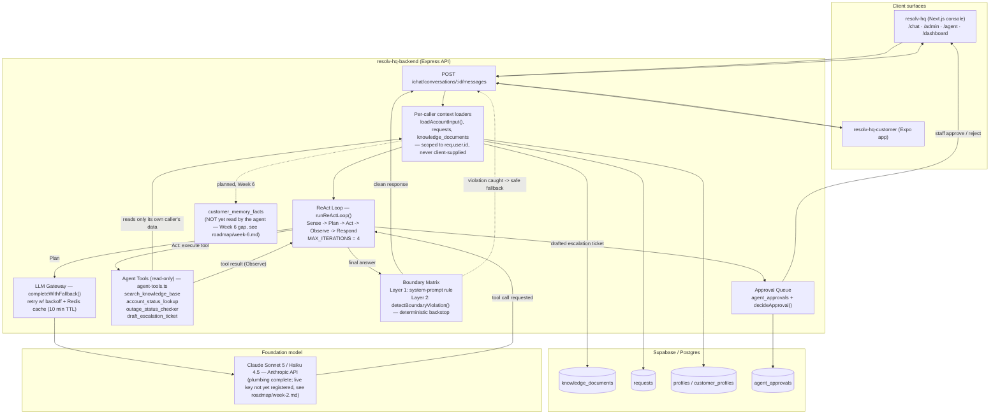

# Architecture Diagram — RESOLV-HQ

**Status:** first version — no diagram existed before this (flagged as a gap in every week from [`roadmap/week-1.md`](./roadmap/week-1.md) onward). Written now, at Week 4, with the tool-calling layer as the headline addition; intended to be **extended in place** for Weeks 5–7 (agent-loop detail, memory, and additional guardrail evidence) rather than redrawn. | **Date:** 25 Sept 2026

## What's new this week (Week 4 — Tools and Function Calling)

The `Agent Tools` subgraph and the Act/Observe edges around it are this week's addition — the four read-only tools from [`tool-catalogue.md`](./tool-catalogue.md), called from the ReAct loop and scoped to per-caller data by the same loaders that feed the model's context. Everything else in the diagram (client surfaces, the LLM gateway, the boundary matrix, the approval queue) reflects what Weeks 1–3 already built, drawn once here so later weeks only need to add to it.

## Diagram

## Reading the diagram

- **Solid arrows** are built and working today; **dashed arrows** are either a safety path that only fires on a violation (Boundary → API) or planned-but-not-built (Loaders → Memory, per the Week 6 gap in the task tracker).
- **`Loaders`** is the single authorization boundary in the whole system: every tool and every prompt context is built from data this one step already scoped to `req.user.id` — no tool has its own selector argument that could name a different caller. See [`tool-failure-auth-test-evidence.md`](./tool-failure-auth-test-evidence.md) for an executed proof of this.
- **`Claude`** is drawn as reachable today because the gateway code is complete (`model-abstraction-and-rate-limiting.md`) — the box's subtitle notes the one remaining gap (no live API key registered yet) so this diagram doesn't overclaim what's running versus what's wired.
- **Extend this diagram, don't replace it:**
  - Week 5: expand the `ReAct` node into its own subgraph showing the five-phase cycle and the `MAX_ITERATIONS` stop condition explicitly, per the Agent Task Contract.
  - Week 6: turn the dashed `Loaders -.-> Memory` edge solid once memory is actually wired into context, and add the MCP-style interface annotation to the `Tools` subgraph.
  - Week 7: annotate `Boundary` and `Approvals` with a pointer to the compiled Failure Catalogue and the 30+ scenario evaluation results once they exist.
